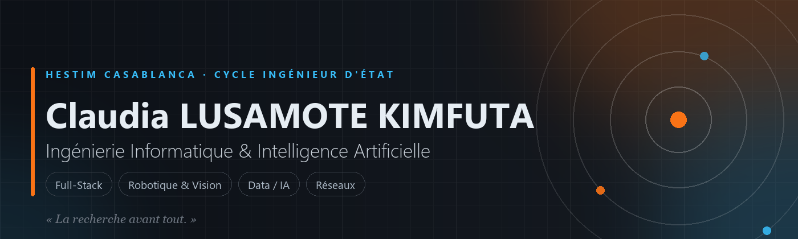
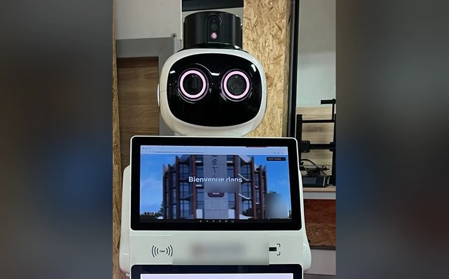
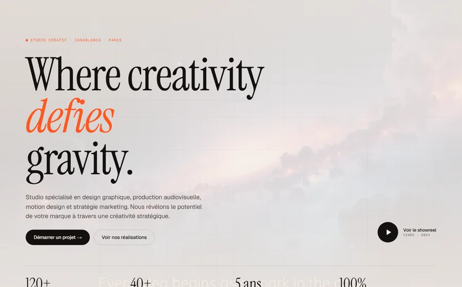
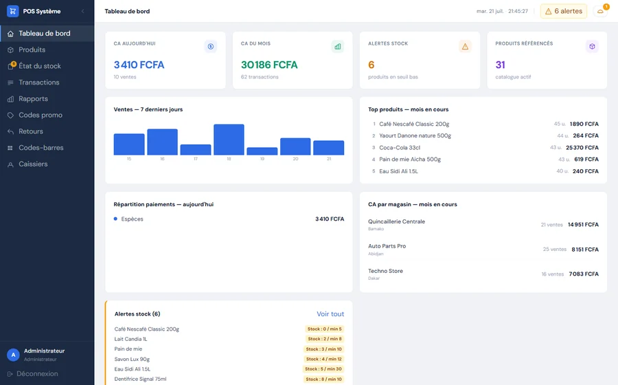
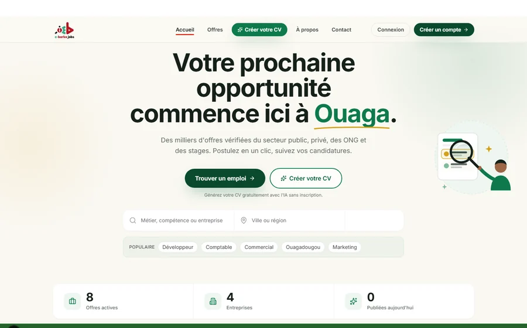
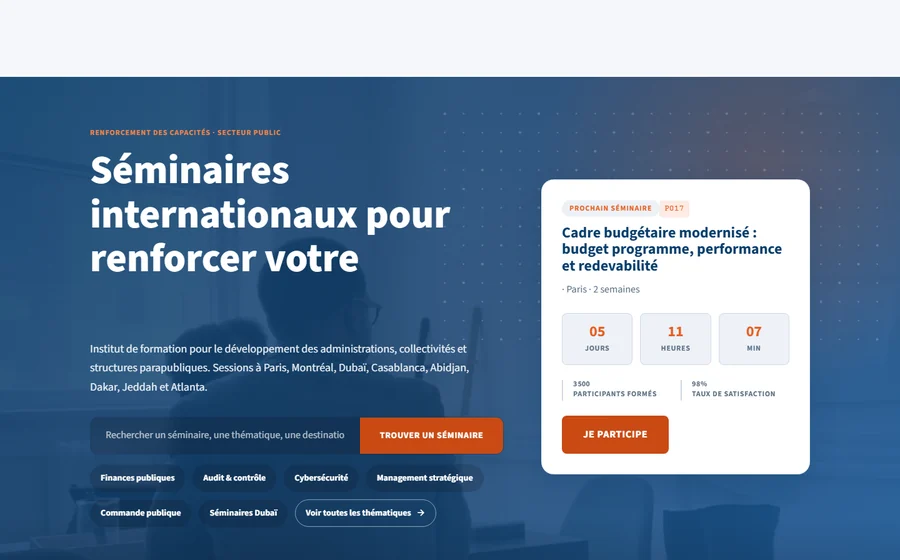
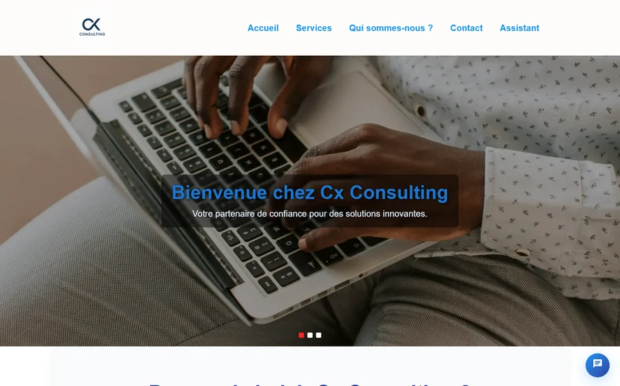
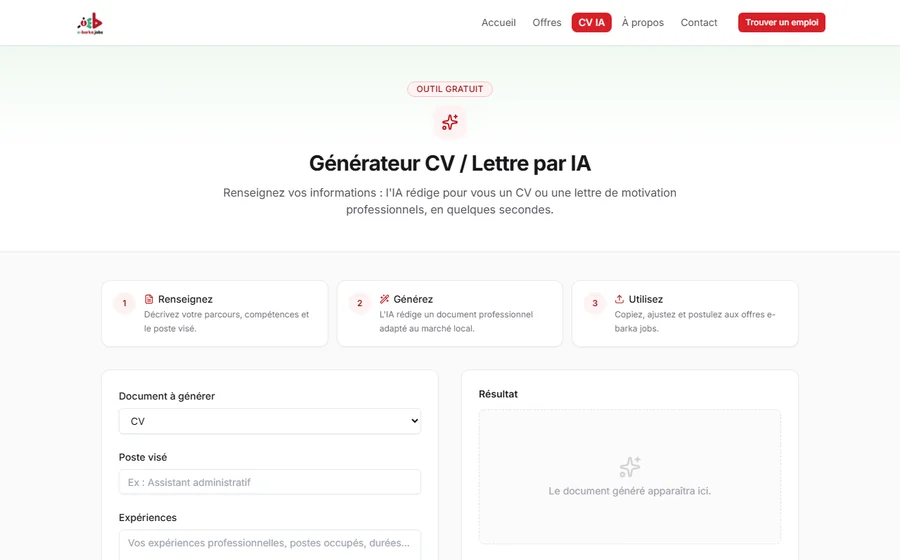

<div align="center">



<br/>


<br/><br/>

[](https://git.io/typing-svg)

<br/>

[](mailto:c.lusamote@hestim.ma)
[](https://www.linkedin.com/in/claudia-lusamote-kimfuta-271b512a8)

[](https://github.com/Africa-Future)
[](mailto:c.lusamote@hestim.ma)

<br/>


</div>

---

## Sommaire

| | | |
|:---:|:---:|:---:|
| [À propos](#à-propos) | [CYBEL](#projet-en-vedette--cybel) | [Projets phares](#projets-phares) |
| [Autres travaux](#autres-travaux) | [Stack technique](#stack-technique) | [Parcours](#parcours) |
| [Certifications](#certifications) | [Activité GitHub](#activité-github) | [Me contacter](#me-contacter) |

---

## À propos

<table>
<tr>
<td width="62%" valign="top">

Étudiant en **cycle d'ingénieur d'État en Ingénierie Informatique & Intelligence Artificielle**
à HESTIM Casablanca. Je conçois des produits complets de la base de données au déploiement
avec un goût particulier pour les systèmes qui touchent le monde réel : robots, caméras, capteurs,
caisses enregistreuses.

```yaml
formation:    Cycle ingénieur d'État · Informatique & IA · HESTIM Casablanca (2025 → 2028)
terrains:     Full-stack web · Robotique collaborative · Vision par ordinateur · Réseaux
langages:     Python · TypeScript / JavaScript · PHP · Java · SQL
en_ce_moment: Plateforme ouverte de commande pour un robot de réception (article IEEE ICRA 2027)
devise:       "La recherche avant tout."
langues:      Français (natif) · Anglais (B1)
```

</td>
<td width="38%" valign="top" align="center">

**En ce moment**

[](https://github.com/Claude20022002/Projet-Stage-2026-Cybel)

<br/>

[](https://github.com/Claude20022002/Rapport-projet-CYBEL)

<br/>

[](https://github.com/Claude20022002)

</td>
</tr>
</table>

<br/>

## Projet en vedette — CYBEL

> **Reverse-engineering non destructif d'un robot de réception commercial fermé**, puis
> reconstruction d'une plateforme ouverte offrant les mêmes fonctionnalités que l'application
> constructeur — voire davantage.

<table>
<tr>
<td width="45%">

</td>
<td width="55%">

Le robot **CIOT TY1251D** associe un châssis ROS à une tête Android, le tout verrouillé par
son constructeur. Le projet documente une méthodologie de rétro-ingénierie (4 hypothèses
testées), puis reconstruit toute la chaîne :

- 🎮 **Téléopération & navigation autonome** — POI, coordonnées, visite guidée multi-arrêts, carte SLAM
- 🗣️ **Chatbot vocal 100 % hors-ligne** — STT Vosk, mot d'éveil, synthèse bilingue FR/EN
- 👁️ **Reconnaissance faciale embarquée** — embeddings sur l'appareil, aucune image transmise
- 📱 **Kiosque visiteur autonome** — déployé directement sur la tête Android via Termux, sans PC
- 📊 **Dashboard opérateur** — diagnostics, patrouille, gestion des visiteurs en temps réel

Le tout validé sur le terrain, avec un article scientifique soumis à **IEEE ICRA 2027**.

`Python` `FastAPI` `ROS / rosbridge` `MQTT` `React` `Vosk` `Android · Termux` `LaTeX`

[](https://github.com/Claude20022002/Projet-Stage-2026-Cybel)
[](https://github.com/Claude20022002/Rapport-projet-CYBEL)

</td>
</tr>
</table>

<br/>

## Projets phares

<table>
<tr>
<td width="50%" valign="top">

### Westmars Studio



Plateforme hybride pour une agence créative franco-marocaine : site vitrine premium
**+ SaaS interne de prospection outbound** (CRM, séquences, tableaux de bord).

`Next.js 16` `NestJS 11` `Prisma` `PostgreSQL` `TypeScript`

[](https://westmars-studio.vercel.app)


</td>
<td width="50%" valign="top">

### PoS Manager



Système de **gestion & facturation avec code-barres** pour commerces : multi-caisses,
mode hors-ligne, gestion de stock, retours, rapports et impression de tickets.

`React 19` `Tailwind 4` `Electron` `Socket.IO` `Quagga2` `Docker`


</td>
</tr>

<tr>
<td width="50%" valign="top">

### e-barka Jobs



Plateforme de recherche et de publication d'emplois pour l'Afrique de l'Ouest, avec
**génération de CV assistée par IA**, espaces candidat/recruteur et back-office.

`Next.js` `TypeScript` `Prisma` `Claude API` `Upstash` `Sentry`

[](https://github.com/Claude20022002/ebarka-jobs)

</td>
<td width="50%" valign="top">

### FinAdmin Tech — Formation Pro



Catalogue de formations professionnelles et de séminaires internationaux : tunnel de
pré-inscription, favoris, FAQ, pages légales et back-office d'administration.

`React 19` `Vite 7` `React Router 7` `FastAPI` `PostgreSQL`

[](https://formation-pro-eight.vercel.app)


</td>
</tr>

<tr>
<td width="50%" valign="top">

### Cx Consulting



Site vitrine d'un cabinet de conseil : identité sur mesure, sections sectorielles
(banque, assurance, énergie, transport…) et animations soignées.

`React` `Vite` `Material UI` `Framer Motion`

[](https://cx-consulting.vercel.app)


</td>
<td width="50%" valign="top">

### CV augmenté par IA — e-barka



Module de génération de CV : l'utilisateur décrit son parcours, un modèle de langage
structure et rédige, le rendu PDF est produit côté serveur.

`Claude API` `Gemini` `Tiptap` `Chromium headless`

[](https://github.com/Claude20022002/ebarka-jobs)

</td>
</tr>
</table>

<br/>

## Autres travaux

<details open>
<summary><b>Voir tous les projets secondaires</b></summary>
<br/>

| Projet | Description | Stack |
|---|---|---|
| **[Manga Accès IA](https://github.com/Claude20022002/manga-acces-ia)** | Transformer une page de manga en expérience de lecture audio accessible | `Python` `Vision` `TTS` |
| **[StudyLib](https://github.com/Claude20022002/StudyLib)** | Bibliothèque numérique collaborative étudiante : partage, recommandation, accès encadré par e-mail institutionnel | `Laravel` `PHP` `MySQL` |
| **[HESTIM Planner](https://github.com/Claude20022002/plan_B_projet_PACTE)** | Planification automatique des cours et réservation de salles avec détection de conflits | `React` `Express` `Sequelize` `MySQL` |
| **[AiKit V2](https://github.com/Claude20022002/aikit_V2)** · **[AiKit UI](https://github.com/Claude20022002/AiKit_UI)** | Tri automatisé de blocs par vision : détection caméra puis rangement par bras robotisé | `Python` `OpenCV` `MyCobot 280Pi` |
| **[Africa Future](https://github.com/Africa-Future)** | Site vitrine d'agence : Tailwind v4 CSS-first, animations GSAP, scroll Lenis, PWA, CI Lighthouse | `React 19` `Tailwind 4` `GSAP` |
| **CatéGO** 🔒 | Le Petit Bac en temps réel sur mobile : salons en ligne, correction par vote, scoring | `React Native` `Expo` `Supabase` |
| **[MyAnime](https://github.com/Claude20022002/MyAnime)** | Catalogue de mangas et d'animes construit sur l'API Jikan | `JavaScript` `API REST` |
| **[weatherPlan](https://github.com/Claude20022002/weatherPlan)** | Application météo branchée sur l'API OpenWeather | `JavaScript` `API REST` |

</details>

<br/>

## Stack technique

<div align="center">


<br/><br/>

<details>
<summary><b>Détail par domaine</b></summary>
<br/>

**Langages**


**Front-end**


**Back-end & données**


**Robotique, IA & outils**


</details>

</div>

<br/>

## Parcours

<details open>
<summary><b>Expériences & formation</b></summary>
<br/>

| Période | Rôle | Structure |
|:---|:---|:---|
| **2026** | Stage — Plateforme ouverte de commande robotique (CYBEL) | HESTIM · FabLab |
| **Sept. 2025** | Assistant logistique & support informatique — automatisation, coordination, interlocuteurs ministériels et diplomatiques | Ambition 28 |
| **Juil. 2025** | Stage robotique — déploiement d'un système collaboratif avec vision IA (MyCobot 280Pi, UltraArm P340) | HESTIM · FabLab |
| **Juin – Juil. 2024** | Téléprospecteur — campagnes ciblées et gestion de base clients (France) | MD Call Center |
| **2023 – 2025** | Membre actif — projets collaboratifs, animation et promotion du club | HIC Code Masters |
| **Fév. – Août 2023** | Aide technicien — maintenance de réacteurs et capacités en arrêt technique | STI Company |

**Formation** — Cycle ingénieur d'État en Informatique & IA, HESTIM Casablanca (2025 – 2028) ·
Prépa ingénierie informatique, HESTIM (2023 – 2025) · Baccalauréat scientifique, option
mathématiques, Gabon (2021 – 2022).

</details>

<br/>

## Certifications

<details>
<summary><b>+14 certifications (Coursera, Cisco, Meta, IBM…)</b></summary>
<br/>

| | |
|---|---|
| 🌐 **CCNA — Introduction aux réseaux** · Cisco | 📊 **Analyse de données avec Python** · IBM |
| ⚛️ **React avancé** · Meta | 📱 **React Native** · Meta |
| 🗄️ **Plateforme de base de données Oracle** · LearnQuest | 🚀 **Node.js & Express — backend** · IBM |
| 📋 **Fondamentaux de la gestion de projet** · Google | 🐘 **Full-Stack avec Laravel & PHP** · Board Infinity |

</details>

<br/>

## Activité GitHub

<div align="center">


<br/><br/>

<picture>
  <source media="(prefers-color-scheme: dark)" srcset="https://github-profile-summary-cards.vercel.app/api/cards/profile-details?username=Claude20022002&theme=github_dark" />
  
</picture>

<br/>

<picture>
  <source media="(prefers-color-scheme: dark)" srcset="https://streak-stats.demolab.com?user=Claude20022002&hide_border=true&theme=github-dark-blue&ring=f97316&fire=f97316&currStreakLabel=38bdf8&background=0d1117" />
  
</picture>

<br/>

<picture>
  <source media="(prefers-color-scheme: dark)" srcset="https://github-profile-summary-cards.vercel.app/api/cards/repos-per-language?username=Claude20022002&theme=github_dark" />
  
</picture>
<picture>
  <source media="(prefers-color-scheme: dark)" srcset="https://github-profile-summary-cards.vercel.app/api/cards/most-commit-language?username=Claude20022002&theme=github_dark" />
  
</picture>

<br/>

<picture>
  <source media="(prefers-color-scheme: dark)" srcset="https://github-readme-activity-graph.vercel.app/graph?username=Claude20022002&bg_color=0d1117&color=e6edf3&line=f97316&point=38bdf8&title_color=f97316&area=true&hide_border=true&custom_title=Contributions%20r%C3%A9centes" />
  
</picture>

<br/><br/>

**Dépôts épinglés**


<br/><br/>

<picture>
  <source media="(prefers-color-scheme: dark)" srcset="https://raw.githubusercontent.com/Claude20022002/Claude20022002/output/github-snake-dark.svg" />
  
</picture>

</div>

<br/>

## Me contacter

<div align="center">

Ouvert aux **stages**, **projets freelance** et **collaborations en robotique / IA**.

[](mailto:c.lusamote@hestim.ma)
[](https://www.linkedin.com/in/claudia-lusamote-kimfuta-271b512a8)
[](https://github.com/Claude20022002)

<sub>Bd Ghandi, Casablanca · Maroc — <i>« La recherche avant tout. »</i></sub>

</div>
